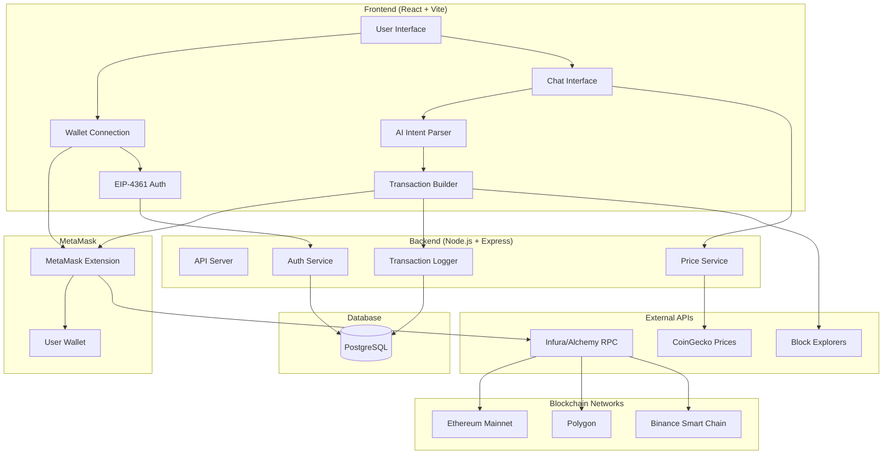
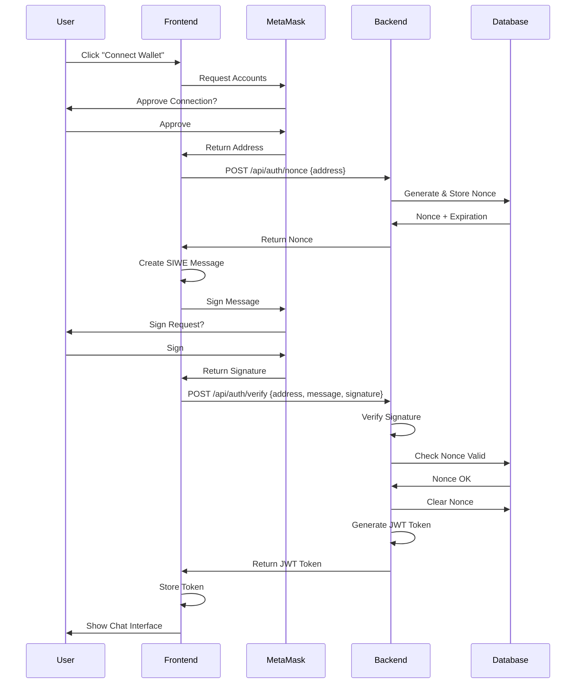
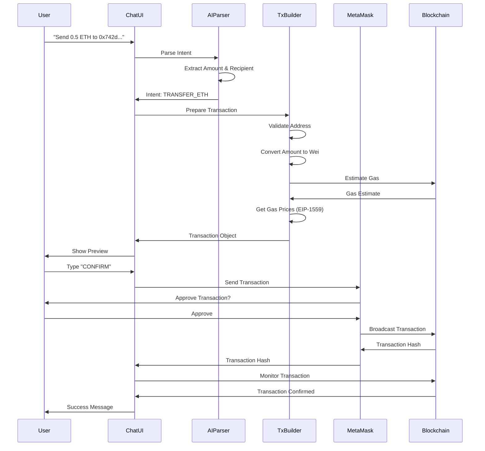
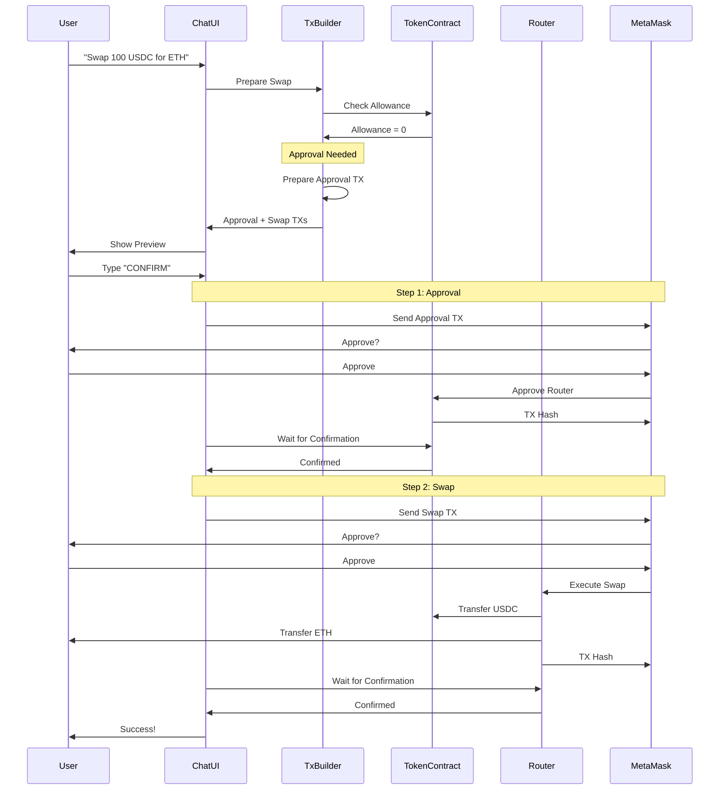

# Architecture & System Design

## System Architecture Diagram



## Authentication Flow (EIP-4361)



## ETH Transfer Flow



## Token Swap Flow (with Approval)



## Component Architecture

### Frontend Components

```
App.tsx
├── ConnectWallet.tsx
│   ├── MetaMask Detection
│   ├── Connection Handler
│   └── Event Listeners
│
├── Auth.tsx
│   ├── Nonce Request
│   ├── SIWE Message Creation
│   ├── Signature Request
│   └── Token Storage
│
└── ChatInterface.tsx
    ├── Message Display
    ├── Input Handler
    ├── Intent Parser Integration
    │
    ├── TransactionPreview.tsx
    │   ├── Transaction Details
    │   ├── Confirmation Input
    │   ├── MetaMask Integration
    │   └── Status Tracking
    │
    ├── BalanceDisplay.tsx
    │   ├── Native Balance
    │   ├── Token Balances
    │   └── USD Values
    │
    └── TransactionHistory.tsx
        ├── Transaction List
        ├── Status Indicators
        └── Block Explorer Links
```

### Backend Routes

```
server.ts
├── /api/auth
│   ├── POST /nonce
│   └── POST /verify
│
├── /api/transactions
│   ├── POST /log
│   ├── GET /history
│   └── PUT /:txHash/status
│
└── /api/prices
    └── GET /:symbol
```

## Data Flow

### User Message → Transaction

1. **User Input**: Natural language message
2. **Intent Parsing**: Extract intent type and parameters
3. **Validation**: Check for missing/invalid parameters
4. **Transaction Building**: Create transaction object
5. **Preview**: Show details to user
6. **Confirmation**: User types "CONFIRM"
7. **Execution**: Send to MetaMask
8. **Monitoring**: Track transaction status
9. **Logging**: Record in database
10. **Feedback**: Show result to user

## Security Layers

```
┌─────────────────────────────────────┐
│ User Authentication (EIP-4361)      │
├─────────────────────────────────────┤
│ JWT Token Verification              │
├─────────────────────────────────────┤
│ Rate Limiting (100 req/min)         │
├─────────────────────────────────────┤
│ Input Validation                    │
├─────────────────────────────────────┤
│ Transaction Confirmation Required   │
├─────────────────────────────────────┤
│ Fraud Detection Checks              │
├─────────────────────────────────────┤
│ Daily Limit Enforcement             │
├─────────────────────────────────────┤
│ Blocklist Verification              │
├─────────────────────────────────────┤
│ HTTPS/TLS Encryption                │
└─────────────────────────────────────┘
```

## Technology Stack

### Frontend
- **Framework**: React 18
- **Build Tool**: Vite
- **Language**: TypeScript
- **Styling**: Tailwind CSS
- **Blockchain**: ethers.js v6
- **Wallet**: @metamask/detect-provider
- **HTTP Client**: axios
- **QR Codes**: qrcode.react

### Backend
- **Runtime**: Node.js 18+
- **Framework**: Express
- **Language**: TypeScript
- **Database**: PostgreSQL 14+
- **Authentication**: jsonwebtoken
- **Security**: helmet, cors
- **Rate Limiting**: express-rate-limit
- **Blockchain**: ethers.js v6

### Infrastructure
- **Frontend Hosting**: Vercel / Netlify
- **Backend Hosting**: Railway / Heroku
- **Database**: PostgreSQL (managed)
- **RPC Providers**: Infura / Alchemy
- **Price Data**: CoinGecko API
- **Block Explorers**: Etherscan APIs

## Scalability Considerations

### Horizontal Scaling
- Stateless backend (JWT tokens)
- Load balancer for multiple instances
- Database connection pooling
- CDN for frontend assets

### Caching Strategy
- Price data: 1 minute cache
- Token metadata: 1 hour cache
- Transaction history: 5 minute cache
- User balances: On-demand refresh

### Performance Optimizations
- Code splitting in frontend
- Lazy loading of components
- Database query optimization
- RPC request batching
- WebSocket for real-time updates (future)

## Future Enhancements

1. **Multi-Signature Support**: Team wallets
2. **Scheduled Transactions**: DCA, recurring payments
3. **Advanced Trading**: Limit orders, stop-loss
4. **Portfolio Analytics**: Charts, P&L tracking
5. **Mobile App**: React Native version
6. **More Chains**: Arbitrum, Optimism, Avalanche
7. **DeFi Integration**: Lending, staking, yield farming
8. **NFT Marketplace**: Browse and trade NFTs
9. **Social Features**: Share transactions, leaderboards
10. **AI Improvements**: Better intent recognition, market insights
